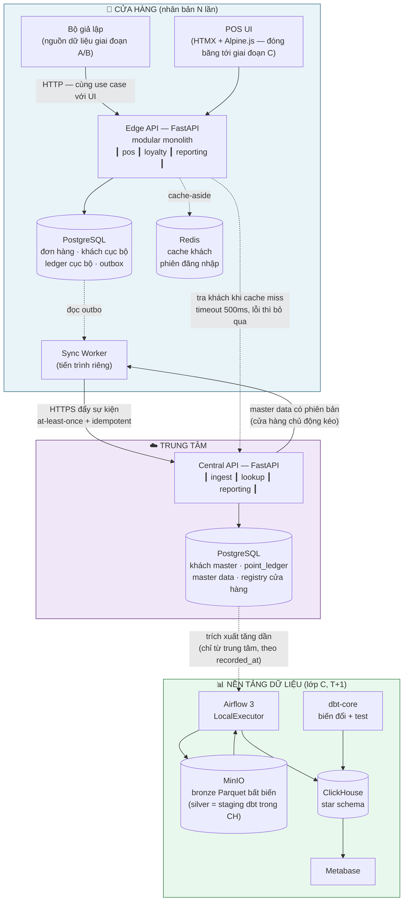
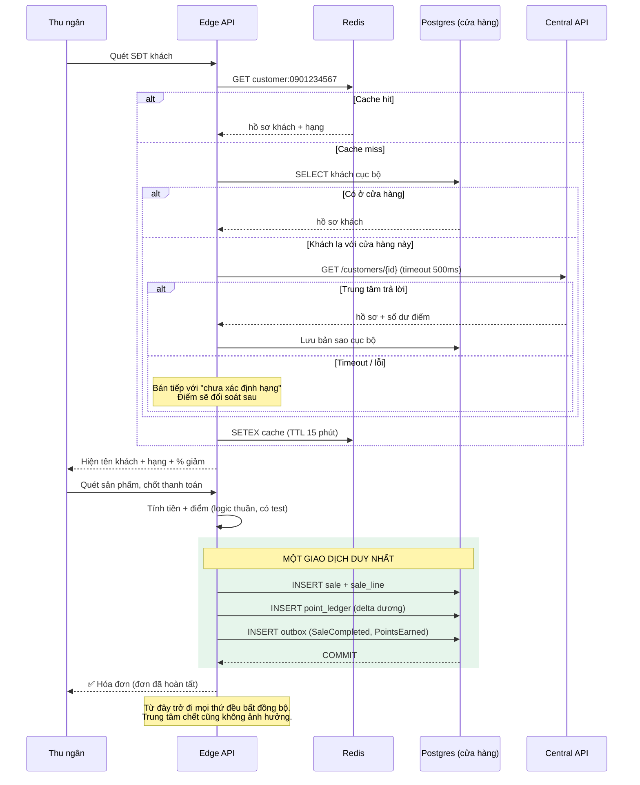

# 03 — Kiến trúc

## 1. Nguyên tắc kiến trúc

Năm nguyên tắc, theo thứ tự ưu tiên. Khi hai nguyên tắc mâu thuẫn, cái đứng trước thắng.

1. **Cửa hàng tự chủ.** Một cửa hàng phải bán được hàng khi bị cô lập hoàn toàn khỏi mạng.
   Mọi thứ khác là thứ yếu so với điều này.
2. **Bất đồng bộ qua ranh giới mạng.** Không giao dịch phân tán, không khóa xuyên mạng,
   không gọi đồng bộ nào có thể chặn việc bán hàng.
3. **Sự kiện bất biến, trạng thái suy ra được.** Ghi những gì đã xảy ra, tính trạng thái từ
   đó. Cho phép kiểm toán, phát lại, sửa sai.
4. **Idempotent ở mọi nơi.** Mọi thao tác qua mạng đều có thể lặp lại. Giả định nó sẽ lặp.
5. **Đơn giản cho tới khi có bằng chứng ngược lại.** Mỗi thành phần hạ tầng phải tự biện
   minh bằng một con số trong [02-scale-capacity.md](02-scale-capacity.md).

## 2. Tổng quan



**Lưu ý về module `reporting`:** đây là bổ sung sau khi phân tích nghiệp vụ
([B03](business/03-analytical-workload.md)). Nó đọc **thẳng Postgres cửa hàng**, không đi qua
nền tảng dữ liệu — vì báo cáo chốt ca phải chạy được khi mất mạng và phải là số của *hôm nay*.

Quan sát: mọi service đều gửi trace qua OTLP tới `grafana/otel-lgtm` (compose profile riêng,
không vẽ trong sơ đồ) — [ADR-009](adr/009-observability-stack.md).

## 3. Ba ranh giới

Toàn bộ kiến trúc xoay quanh ba đường ranh giới. Hiểu ba cái này là hiểu hệ thống.

### Ranh giới 1 — Cửa hàng ↔ Trung tâm *(ranh giới chịu lỗi)*

Đây là ranh giới quan trọng nhất. **Nó có thể đứt bất cứ lúc nào và thường xuyên đứt.**

| Chiều | Cơ chế | Khi đứt thì sao? |
|---|---|---|
| Cửa hàng → Trung tâm | Outbox + worker đẩy HTTP | Sự kiện dồn trong outbox, tự chảy khi nối lại. Không mất gì |
| Trung tâm → Cửa hàng | Cửa hàng chủ động kéo master data có phiên bản | Cửa hàng dùng bản cache. Giá có thể cũ vài phút — chấp nhận được |
| Tra cứu khách | HTTP đồng bộ, **timeout 500ms** | Bỏ qua, bán hàng bình thường, xử lý điểm sau |

**Quy tắc tuyệt đối:** không có lệnh gọi nào qua ranh giới này được phép nằm trên đường
đi tới việc chốt một đơn hàng.

### Ranh giới 2 — POS ↔ Loyalty *(ranh giới module)*

Ở v1, hai module này nằm trong **cùng một tiến trình** (modular monolith). Nhưng ranh giới
được giữ nghiêm ngặt như thể chúng là hai service:

- Giao tiếp chỉ qua interface khai báo rõ, không import chéo tầng trong
- Không truy vấn thẳng bảng của nhau
- Không dùng chung giao dịch DB (trừ ghi outbox)

Lý do giữ nghiêm: **đây chính là đường cắt khi tách microservice sau này.** Nếu để rò rỉ
bây giờ, sau này tách sẽ rất đau. Xem [ADR-004](adr/004-modular-monolith.md).

### Ranh giới 3 — Vận hành ↔ Phân tích

Hệ thống vận hành (OLTP) không bao giờ bị truy vấn phân tích chạm vào.

- Trích xuất tăng dần **chỉ từ Postgres trung tâm**, watermark `recorded_at` có độ trễ an
  toàn ([17 §4](17-data-flow.md) bẫy 1). Không bao giờ đọc Postgres cửa hàng: nó nằm sau NAT,
  và `recorded_at` chỉ có ở trung tâm
- Lake là bản sao bất biến — warehouse luôn dựng lại được từ đây
- Dashboard chỉ đọc ClickHouse, không bao giờ đọc Postgres

## 4. Luồng chính

### 4.1. Bán một đơn hàng (đường đi quan trọng nhất)



**Điểm mấu chốt:** ngay khi `COMMIT` thành công, giao dịch **đã hoàn tất**. Không gì ở
phía sau có thể làm hỏng nó.

### 4.2. Đồng bộ lên trung tâm

```mermaid
sequenceDiagram
    participant W as Sync Worker
    participant P as Postgres (cửa hàng)
    participant X as Central API
    participant D as Postgres (trung tâm)

    loop mỗi 2 giây
        W->>P: SELECT * FROM outbox<br/>WHERE sent_at IS NULL<br/>ORDER BY id LIMIT 100<br/>FOR UPDATE SKIP LOCKED
        P-->>W: lô sự kiện

        W->>X: POST /events (lô, mỗi sự kiện có event_id)

        X->>D: INSERT ... ON CONFLICT (event_id) DO NOTHING
        Note over D: Idempotency nằm ở đây.<br/>Gửi lại 100 lần vẫn chỉ ghi 1 dòng.
        D-->>X: ok
        X-->>W: 200 {đã nhận: [event_id...]}

        W->>P: UPDATE outbox SET sent_at = now()
    end

    Note over W,X: Nhánh lỗi: xem 14 §4 — lỗi đường truyền KHÔNG tính lượt thử;<br/>chỉ sự kiện bị trung tâm từ chối mới đếm tới dead-letter
```

`FOR UPDATE SKIP LOCKED` cho phép chạy nhiều worker song song mà không giẫm chân nhau —
scale seam sẵn có, không cần đổi gì.

### 4.3. Đường đi của điểm tích lũy

Đây là phần dễ sai nhất, nên tách riêng:

```
Cửa hàng bán hàng
   └─ ghi point_ledger CỤC BỘ (+50)      → số dư cục bộ cập nhật ngay, khách thấy liền
   └─ ghi outbox (PointsEarned)
        └─ worker đẩy lên trung tâm
             └─ trung tâm ghi point_ledger TRUNG TÂM (+50, dedupe theo event_id)
                  └─ cập nhật snapshot point_balance
                       └─ cửa hàng khác kéo về khi cần
```

**Nguồn sự thật: ledger trung tâm.** Ledger cục bộ là bản ghi tạm, và là bằng chứng để
phát lại. Số dư cục bộ là gợi ý hiển thị.

Khi cửa hàng kéo số dư từ trung tâm, nó phải cộng thêm các dòng ledger cục bộ **chưa đồng
bộ** để tránh hiển thị tụt lùi:

```
số dư hiển thị = số dư từ trung tâm + SUM(ledger cục bộ chưa gửi)
```

## 5. Mô hình chịu lỗi

| Hỏng hóc | Ảnh hưởng | Tự phục hồi? |
|---|---|---|
| Redis chết | Chậm hơn (mọi lookup xuống Postgres) | ✅ Có |
| Trung tâm chết | Không bán được cho khách **lạ với cửa hàng đó** với đúng hạng. Mọi thứ khác bình thường | ✅ Outbox tự chảy |
| Mạng cửa hàng đứt | Bán hàng bình thường, điểm tích cục bộ | ✅ Có |
| Postgres cửa hàng chết | **Cửa hàng đó dừng bán** | ❌ Cần can thiệp |
| Sync worker chết | Outbox dồn, không mất gì | ✅ Khi khởi động lại |
| ClickHouse chết | Dashboard không dùng được. Vận hành không bị ảnh hưởng | ✅ Có |
| MinIO chết | Pipeline dừng. Vận hành không bị ảnh hưởng | ✅ Có |
| Airflow chết | Warehouse ngừng cập nhật. Vận hành không bị ảnh hưởng | ✅ Có |

**Chỉ có một điểm lỗi đơn làm dừng việc bán hàng: Postgres của chính cửa hàng đó.** Đó là
đúng đắn — nó đã cục bộ, và bán kính ảnh hưởng chỉ là một cửa hàng.

## 5b. Ba lớp truy vấn *(bổ sung 2026-09-11)*

> Phát hiện từ [business/03-analytical-workload.md](business/03-analytical-workload.md):
> kiến trúc ở trên chỉ phục vụ **lớp C**, trong khi **lớp A mới là lớp dùng nhiều nhất**.

| Lớp | Ví dụ | Độ tươi | Chạy ở đâu |
|---|---|---|---|
| **A — Vận hành** | Chốt ca, doanh thu hôm nay, tra hóa đơn cũ để trả hàng | **T+0 bắt buộc** | **Postgres cửa hàng** — phải chạy được khi offline |
| **B — Quản lý** | 30 ngày của cửa hàng tôi, top sản phẩm tháng | T+0 → T+1 | **Postgres trung tâm** |
| **C — Phân tích chuỗi** | Doanh thu toàn chuỗi 24 tháng, cohort, market basket | T+1 | **Lake → Warehouse** |

**Quy tắc:** lớp A **không bao giờ** đi qua warehouse. Quản lý cửa hàng cần số của *hôm nay*;
pipeline T+1 về mặt định nghĩa không phục vụ được. Và chốt ca phải làm được khi mất mạng.

## 6. Nền tảng dữ liệu

```
Postgres trung tâm ──► BRONZE (Parquet thô, bất biến)
                        s3://lake/bronze/central/<bảng>/dt=<ngày nạp>/<start>_<end>.parquet
                             │  s3() + insert_deduplication_token
                             ▼
                        ClickHouse bronze_* ──► dbt staging (= SILVER: làm sạch, khử trùng)
                             │
                             ▼
                        ClickHouse — GOLD (star schema)
                        dim_date · dim_store · dim_employee · dim_shift
                        dim_product · dim_customer (SCD1 ở giai đoạn A; SCD2 là C)
                        fact_sale_line · fact_payment (riêng, ràng buộc #5) · fact_point_event
                             │
                             ▼
                        Metabase (giai đoạn C)
```

Hiện thực (2026-09-24): S4 + S5 ở [`packages/pipeline/`](../packages/pipeline/), S6 ở
[`data_platform/dbt/`](../data_platform/dbt/), nối bằng DAG `retail_pipeline` (Airflow 3 +
cosmos). Chi tiết từng chặng và 5 bẫy: [17](17-data-flow.md).

Nguyên tắc:
- **Bronze bất biến.** Không bao giờ sửa. Xóa warehouse thì dựng lại được toàn bộ từ đây
  (đã làm thật: `DROP DATABASE` → một lượt DAG → số khớp tuyệt đối).
- **Mọi bước idempotent.** Bronze: `insert_deduplication_token` = đường dẫn + SHA-256. Mart:
  thay trọn phân vùng tháng bị ảnh hưởng (`insert_overwrite`), không chèn thêm.
- **Biến đổi nằm trong dbt**, không nằm trong Python. Có test, có lineage, có docs miễn phí.
- **Fact ở mức dòng sản phẩm** (`fact_sale_line`), không phải mức đơn — chi tiết nhất có
  thể, gộp lên sau bằng SQL.

## 7. Những gì cố tình KHÔNG làm ở v1

| Không làm | Vì sao | Khi nào làm |
|---|---|---|
| Microservices | Solo dev, 1 tháng. Ranh giới module đã đủ | Khi có team ≥ 3 người |
| Kafka | Outbox + HTTP bền tương đương ở quy mô này | > 100 cửa hàng ([02](02-scale-capacity.md) §4) |
| Kubernetes | Compose đủ cho POC | Khi lên production đa node |
| CQRS / Event Sourcing toàn phần | Chỉ điểm tích lũy cần ledger, phần còn lại không | Không cần |
| Service mesh, tracing phân tán đầy đủ | Log có `trace_id` đủ dùng | Khi > 5 service |
| Multi-region | Một quốc gia | Khi mở rộng quốc tế |

---
*Changelog: 2026-09-25 — §2 sơ đồ: silver không nằm trên MinIO; §6 theo hiện thực (dim_shift,
fact_payment, SCD1, vị trí code, cách idempotent của bronze và mart).*

*Changelog: 2026-09-23 — theo [ADR-010](adr/010-data-flow-first.md) và [17](17-data-flow.md):
thêm bộ giả lập vào sơ đồ; **bỏ mũi tên trích xuất từ Postgres cửa hàng** (mâu thuẫn với NAT
ở 14 §2 và với việc bronze phân vùng theo `recorded_at`, cột chỉ có ở trung tâm); §4.2 trỏ về
nhánh lỗi đã đính chính ở 14 §4; §5 Dagster → Airflow (sót từ ADR-007); §6 bố cục bronze mới,
silver là staging dbt.*

*Changelog: 2026-09-11 — tạo mới.*
