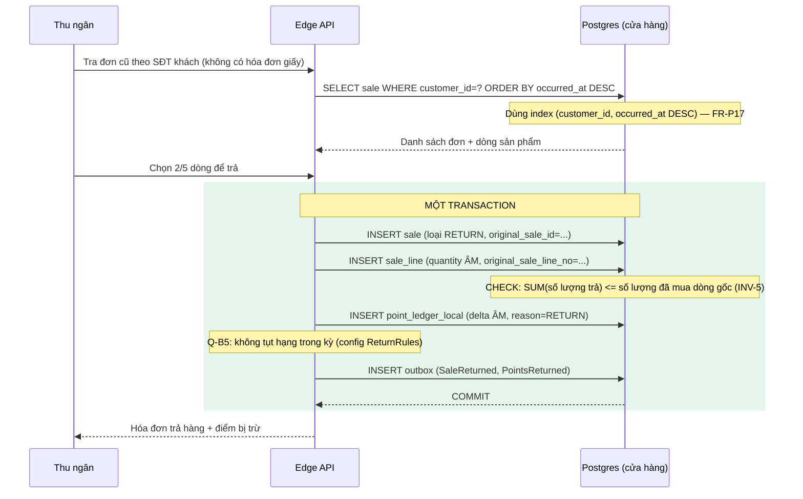
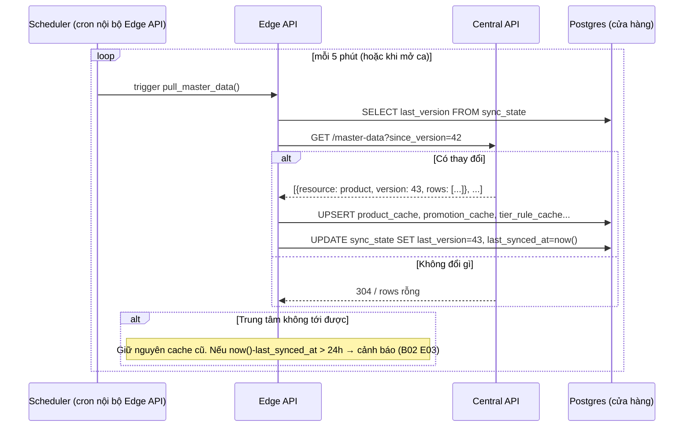
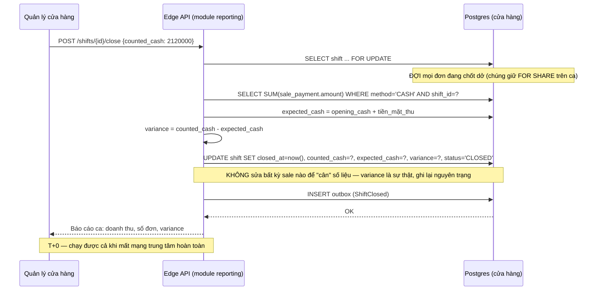
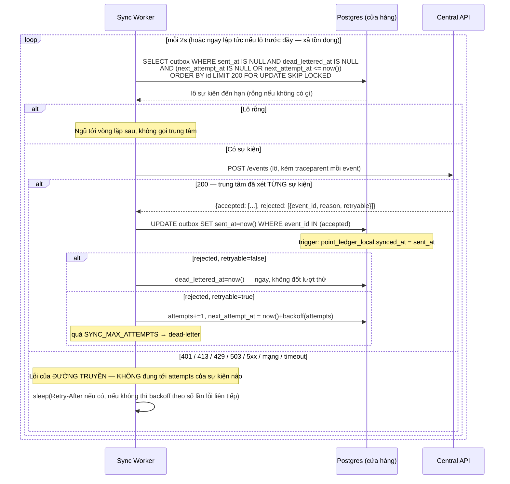

# 14 — Sơ đồ tuần tự: 4 luồng còn lại

> [03-architecture.md §4](03-architecture.md) đã vẽ luồng **bán hàng**. Đây là 4 luồng còn
> lại — thiếu chúng dễ bỏ sót case khi code, vì mỗi luồng chạm một ràng buộc khác nhau.

---

## 1. Trả hàng (một phần)

**Điểm khác biệt với luồng bán:** không gọi trung tâm đồng bộ nào ở đây — trả hàng hoàn
toàn cục bộ, giống bán hàng. Case R04 (trả ở cửa hàng khác nơi mua) **không** được hỗ trợ ở
v1 vì cần dữ liệu đơn gốc mà cửa hàng B không có khi offline ([ADR-008 C4](adr/008-remaining-decisions.md) áp dụng tinh thần tương tự).

---

## 2. Kéo master data (Trung tâm → Cửa hàng)

**Ràng buộc:** cửa hàng **chủ động kéo**, trung tâm không bao giờ đẩy — vì cửa hàng
thường sau NAT, trung tâm không có đường gọi vào (xem [ADR-003](adr/003-outbox-not-kafka.md)
lý do tương tự cho hướng ngược lại).

---

## 3. Chốt ca

**Khóa ca là bắt buộc (2026-09-23).** `place_sale` đọc ca bằng `FOR SHARE`, còn đóng ca lấy
`FOR UPDATE` **trước** khi cộng tiền. Thiếu khóa này, một đơn đã đọc ca nhưng chưa kịp chèn
dòng `sale` sẽ commit ngay sau lúc đóng ca cộng tiền. Đơn đó nằm trong ca đã đóng, và
`expected_cash` thiếu đúng số tiền của nó. Khóa ngoại `sale → shift` chỉ chặn được từ lúc
dòng `sale` đã chèn, không che được khe hở giữa đọc ca và chèn đơn.
`test_close_waits_for_a_sale_that_is_committing` dừng đúng trong khe đó (đã kiểm đột biến).

**Đây là luồng chứng minh lớp truy vấn A ([B03](business/03-analytical-workload.md))**: mọi
bước đều nằm trong Postgres cửa hàng, không có bước nào phụ thuộc trung tâm.

---

## 4. Đồng bộ lên trung tâm (bổ sung — khía cạnh lỗi)

[03-architecture §4.2](03-architecture.md) đã vẽ đường thành công. Đây là nhánh **lỗi và
retry**, thường bị bỏ qua khi thiết kế:

> ⚠️ **Đính chính 2026-09-23.** Bản đầu của sơ đồ này có nhánh *"Lỗi mạng / timeout →
> `attempts += 1` → quá ngưỡng thì dead-letter"*. Làm đúng theo đó, một cửa hàng mất mạng vài
> phút sẽ tự đẩy dữ liệu **đúng** của mình vào dead-letter — vi phạm thẳng AT-02 và NFR-01.
> `attempts` chỉ được đếm số lần **trung tâm đã xét và từ chối** sự kiện; mất mạng thì lùi cả
> vòng lặp. Test `test_central_unreachable_never_consumes_attempts` giữ quy tắc này (đã kiểm
> bằng đột biến: đưa lỗi cũ trở lại thì test đỏ).

**Điểm hay bỏ sót:** xử lý lô **một phần thành công** — nếu worker coi cả lô là thất bại
khi chỉ 1/200 sự kiện lỗi, 199 sự kiện kia sẽ bị gửi lại (vô hại nhờ idempotency, nhưng lãng
phí và làm chậm hội tụ). Hợp đồng `{accepted, rejected}` ở [13-api-contracts §2](13-api-contracts.md)
tồn tại chính để giải quyết việc này.

---
*Changelog: 2026-09-23 (lần 2) — §3: khóa ca `FOR SHARE`/`FOR UPDATE` giữa chốt đơn và đóng ca.*

*Changelog: 2026-09-23 — §4 viết lại theo hiện thực sync worker: tách lỗi đường truyền khỏi lỗi
của sự kiện (đính chính nhánh sai), thêm `retryable`, `next_attempt_at`, trigger `synced_at`.*

*Changelog: 2026-09-11 — tạo mới, bổ sung 4 luồng còn thiếu so với 03-architecture.*
